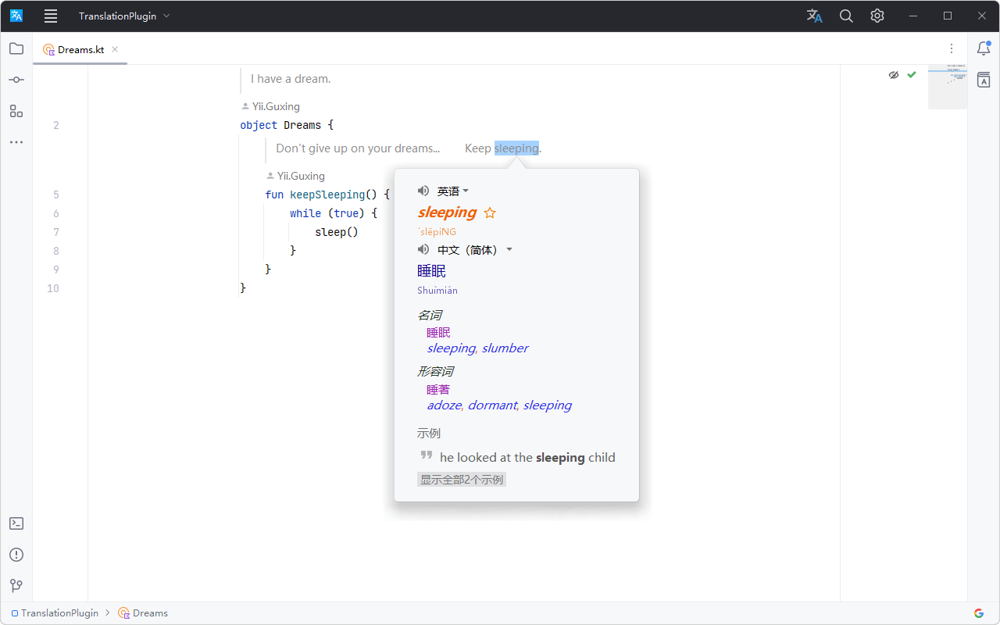
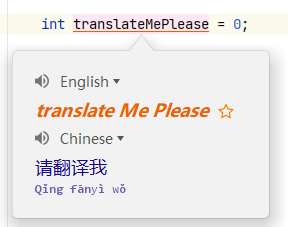
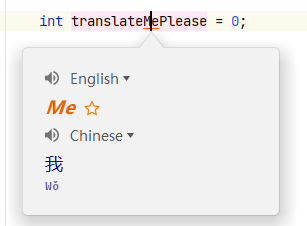

# 简介 :id=introduction

TranslationPlugin 是一个基于 IntelliJ IDE/Android Studio 的翻译插件。它集成了谷歌翻译、微软翻译、DeepL 翻译、有道翻译、百度翻译等众多翻译引擎，在你的 IDE 内随时对想要翻译的文本、代码注释、代码文档进行翻译。

## 特征 :id=features

- 多翻译引擎
  - 谷歌翻译
  - 微软翻译
  - 有道翻译
  - 百度翻译
  - 阿里翻译
  - DeepL 翻译
- 多语言互译
- 文档翻译
- 语音朗读
- 自动选词
- 自动单词拆分
- 单词本

## 兼容 :id=compatibility

插件支持的 IDE 产品：
- Android Studio
- AppCode
- CLion
- DataSpell
- DataGrip
- GoLand
- HUAWEI DevEco Studio
- IntelliJ IDEA Ultimate
- IntelliJ IDEA Community
- IntelliJ IDEA Educational
- MPS
- PhpStorm
- PyCharm Professional
- PyCharm Community
- PyCharm Educational
- Rider
- RubyMine
- WebStorm

# 快速开始 :id=quick-start

## 安装插件 :id=installation

  <iframe src="https://plugins.jetbrains.com/embeddable/install/8579" frameborder="none"></iframe>

- **使用 IDE 内置插件系统安装（推荐）：**
  - <kbd>**Preferences(Settings)**</kbd> > <kbd>**Plugins**</kbd> > <kbd>**Marketplace**</kbd> > 搜索 **Translation** > 点击 <kbd>**Install**</kbd> 安装。
- **手动安装：**
  - 到 [Github Releases][gh:releases] 或者 [JetBrains 插件中心][plugin:versions]上下载与你的 IDE 兼容的最新版本的插件包；
  - <kbd>**Preferences(Settings)**</kbd> > <kbd>**Plugins**</kbd> > <kbd>⚙</kbd> > <kbd>**从磁盘安装插件...**</kbd> > 选择插件包并安装（无需解压）。

安装好后重新启动 **IDE** 即可。

## 开始使用 :id=usage

#### 1. 注册翻译服务（可选）

- 注册翻译服务（[DeepL][deepl]、[有道智云][youdao-cloud]、[百度翻译开放平台][baidu-dev]、[阿里云机器翻译][ali-mt]）帐号，开通翻译服务并获取其**认证密钥**或者**应用ID-密钥对**。
- 绑定**认证密钥**和**应用ID-密钥对**：<kbd>**Preferences(Settings)**</kbd> > <kbd>**Tools**</kbd> > <kbd>
  **Translation**</kbd> > <kbd>**常规**</kbd> > <kbd>**翻译引擎**</kbd> > <kbd>**配置...**</kbd>

#### 2. 开始翻译

选择文本或者鼠标指向文本 > 单击<kbd>**鼠标右键**</kbd> > <kbd>**翻译**</kbd>

?> 或者使用快捷键进行翻译，详见 [动作](#actions)。

#### 3. 翻译并替换

翻译目标文本并将其替换。当翻译目标语言为英文时，会分别输出为`骆驼式输出`、`含单词分隔符输出`（输出包含多个单词时，分隔符可在插件配置页面中配置：<kbd>**插件设置**</kbd> > <kbd>**翻译并替换**</kbd> > <kbd>**分隔符**</kbd>）和`原输出`。

?> _开启右键菜单项：_<kbd>**插件设置**</kbd> > <kbd>**翻译并替换**</kbd> > 勾选<kbd>**在右键菜单显示替换操作**</kbd>

?> *用法：*选择文本或者鼠标指向文本 > 单击<kbd>**鼠标右键**</kbd> > <kbd>**翻译和替换...**</kbd>（或者使用快捷键进行翻译，详见 [动作](#actions)）。

#### 4. 翻译文档

- 在文档视图上单击<kbd>**鼠标右键**</kbd> > <kbd>**翻译文档**</kbd>，即可切换翻译文档。
- 当开启**自动翻译文档**后，在你查看文档时文档会被自动翻译。

?> _开启自动翻译文档：_<kbd>**插件设置**</kbd> > <kbd>**其他**</kbd> > 勾选<kbd>**自动翻译文档**</kbd>

#### 5. 切换翻译引擎

点击 **IDE** 状态栏的翻译引擎状态图标或者使用快捷键<kbd>**Ctrl + Shift + S**</kbd>（Mac OS: <kbd>**Control + Meta + Y**</kbd>）可以快速切换翻译引擎。

[gh:releases]: https://github.com/YiiGuxing/TranslationPlugin/releases
[plugin:versions]: https://plugins.jetbrains.com/plugin/8579-translation/versions
[deepl]: https://www.deepl.com
[youdao-cloud]: https://ai.youdao.com
[baidu-dev]: https://fanyi-api.baidu.com/manage/developer
[ali-mt]: https://www.aliyun.com/product/ai/base_alimt

# 动作 :id=actions

#### 1. 显示翻译对话框... :id=show-trans-dialog-action

打开翻译对话框。默认显示在工具栏上。默认快捷键：
- Windows - <kbd>**Ctrl + Shift + O**</kbd>
- macOS - <kbd>**Control + Meta + I**</kbd>

#### 2. 翻译 :id=translate-action

取词并翻译。如果有已选择的文本，优先从选择的文本内取词，否则默认以最大范围自动取词（该取词模式可在Settings中配置）。默认显示在编辑器右键菜单上，默认快捷键：
- Windows - <kbd>**Ctrl + Shift + Y**</kbd>
- macOS - <kbd>**Control + Meta + U**</kbd>

#### 3. 翻译（包含） :id=translate-inclusive-action

取词并翻译。自动以最大范围取最近的所有词，忽略手动选择的文本。默认快捷键：（无）

#### 4. 翻译（独占） :id=translate-exclusive-action

取词并翻译。自动取最近的单个词，忽略手动选择的文本。默认快捷键：（无）

#### 5. 翻译和替换...

翻译并替换。取词方式同[翻译操作](#translate-action)。默认快捷键：
- Windows - <kbd>**Ctrl + Shift + X**</kbd>
- macOS - <kbd>**Control + Meta + O**</kbd>

#### 6. 翻译文档

翻译文档注释内容。默认显示在编辑器右键菜单上，光标在文档注释块内时可用。默认快捷键：（无）

#### 7. 切换快速文档翻译

快速文档中将文档内容在译文和原文之间切换。窗口聚焦于快速文档弹出窗或者文档工具窗口时可用。默认快捷键(同[翻译操作](#translate-action))：
- Windows - <kbd>**Ctrl + Shift + Y**</kbd>
- macOS - <kbd>**Control + Meta + U**</kbd>

#### 8. 翻译文本组件

翻译一些文本组件（如快速文档、提示气泡、输入框……）中选中的文本，不支持自动取词。默认快捷键(同[翻译操作](#translate-action))：
- Windows - <kbd>**Ctrl + Shift + Y**</kbd>
- macOS - <kbd>**Control + Meta + U**</kbd>

#### 9. 切换翻译引擎

快速切换翻译引擎。默认快捷键：
- Windows - <kbd>**Ctrl + Shift + S**</kbd>
- macOS - <kbd>**Control + Meta + Y**</kbd>

#### 10. 每日一词

显示每日单词对话框。默认快捷键：（无）

#### 11. 其他

- **翻译对话框快捷键：**
  - 显示源语言列表 - <kbd>**Alt + S**</kbd>
  - 显示目标语言列表 - <kbd>**Alt + T**</kbd>
  - 交换语言 - <kbd>**Alt + Shift + S**</kbd>
  - 切换窗口固定状态 - <kbd>**Alt + P**</kbd>
  - 播放TTS - <kbd>**Alt/Meta/Shift + Enter**</kbd>
  - 收藏到单词本 - <kbd>**Ctrl/Meta + F**</kbd>
  - 显示历史记录 - <kbd>**Ctrl/Meta + H**</kbd>
  - 复制译文 - <kbd>**Ctrl/Meta + Shift + C**</kbd>
  - 清空输入 - <kbd>**Ctrl/Meta + Shift + BackSpace/Delete**</kbd>
  - 展开更多翻译 - <kbd>**Ctrl/Meta + Down**</kbd>
  - 收起更多翻译 - <kbd>**Ctrl/Meta + UP**</kbd>
- **翻译气泡快捷键：**
  - 以对话框打开 - <kbd>**Ctrl + Shift + Y**</kbd> / <kbd>**Control + Meta + U**</kbd>